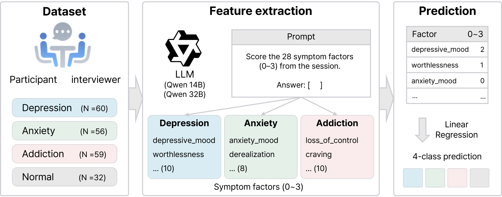

# Interpretable Classification of Mental Disorders from Korean Counseling Transcripts

**대규모 언어모델 기반 증상요인 추출을 활용한 한국어 심리상담 텍스트의 해석 가능한 정신질환 분류**

  

## Overview

This study proposes an interpretable method for classifying Korean psychological counseling transcripts into four categories: depression, anxiety, addiction, and normal. A large language model (LLM) rates the intensity of 28 expert-defined, DSM-5-TR-based symptom factors at the session level, and the resulting factor vector is fed into a multinomial logistic regression classifier. On a Korean counseling dataset from AI Hub, the proposed method achieved a person-level macro-F1 of 0.724, significantly outperforming zero-shot (0.450), few-shot (0.562), and a Direct-to-LR baseline (0.618) that applies the same supervised pipeline to LLM-rated category-level scores. The significant contributing factors were consistent with the core symptoms of DSM-5-TR, and the extraction agreement of key factors was validated against expert gold labels, demonstrating that the proposed method couples competitive classification performance with intrinsic, coefficient-level interpretability without task-specific fine-tuning.