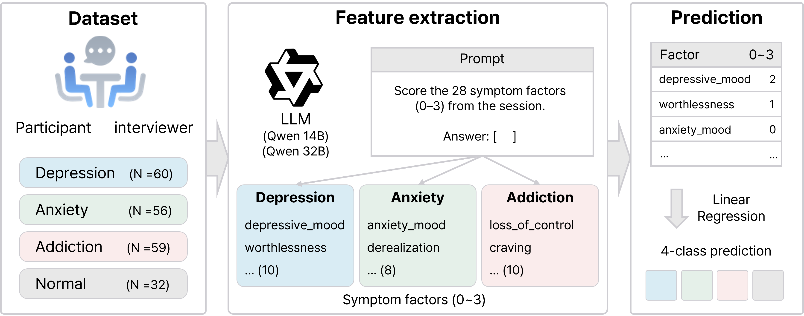

# Interpretable Classification of Mental Disorders from Korean Counseling Transcripts

**대규모 언어모델 기반 증상요인 추출을 활용한 한국어 심리상담 텍스트의 해석 가능한 정신질환 분류**

<p align="center">
  
</p>

## Overview

An LLM rates the intensity (0–3) of 28 expert-defined, DSM-5-TR-based symptom factors for each counseling session, and a multinomial logistic regression classifies clients into depression, anxiety, addiction, or normal. Classification is evaluated at the client level (207 clients, 1,440 sessions) with client-grouped 5-fold cross-validation, and the regression coefficients provide factor-level interpretability.

All experiments use the **full, untruncated counseling transcripts** (up to 26,674 input tokens) under identical conditions for the proposed method and every baseline.

## Results

Client-level macro-F1 with 95% client-level cluster bootstrap CIs (2,000 resamples).

| Method | Qwen2.5-14B-Instruct | Qwen2.5-32B-Instruct |
|---|---:|---:|
| Zero-shot | 0.442 [0.369, 0.509] | 0.500 [0.430, 0.567] |
| Few-shot (4-shot) | 0.568 [0.504, 0.633] | 0.614 [0.547, 0.677] |
| Direct-to-LR | 0.648 [0.583, 0.707] | 0.631 [0.567, 0.690] |
| **Factor-28 → LR (proposed)** | **0.735 [0.670, 0.792]** | **0.721 [0.659, 0.777]** |

- The proposed method outperforms all three baselines for both models (client-level McNemar, Holm-adjusted p < 0.05).
- The difference between 14B and 32B is not significant (Δ = +0.014, 95% CI [−0.045, +0.072]; McNemar p = 0.61).
- Full tables, per-class metrics, figures and all re-analyses are in [`expected/`](expected/).

## Experimental setup

| Item | Value |
|---|---|
| Models | Qwen2.5-14B-Instruct (`cf98f3b3bbb457ad9e2bb7baf9a0125b6b88caa8`), Qwen2.5-32B-Instruct (`5ede1c97bbab6ce5cda5812749b4c0bdf79b18dd`) |
| Inference | vLLM 0.19.1, bfloat16, no quantization, greedy (temperature 0, top-p 1.0), seed 0 |
| Max new tokens | 512 (proposed) / 32 (zero-, few-shot) / 128 (Direct-to-LR) |
| Classifier | multinomial logistic regression, L2 (C = 1.0), `class_weight='balanced'`, standardization fit on training folds only, client-grouped 5-fold CV, client prediction = mean of session probabilities |
| Software | Python 3.12.10, PyTorch 2.10.0, transformers 5.11.0, scikit-learn 1.9.0 (exact environment in `uv.lock`) |
| Hardware | 2 × NVIDIA RTX A6000 48 GB (tensor parallel 2), driver 595.91.07, CUDA 12.8 |
| Runtime | about 7.7 h for all 8 configurations |

## Data

The Korean psychological counseling dataset from [AI Hub](https://www.aihub.or.kr) cannot be redistributed. Request access from AI Hub and place the labeling data as:

```
data/raw/
├── Training/02.라벨링데이터/      # 1,279 JSON files
└── Validation/02.라벨링데이터/    # 176 JSON files
```

`data/`, `results/` and other session-level outputs are git-ignored. The repository only ships aggregate results and run records in `expected/`.

## Reproduce

Requires Linux with NVIDIA GPUs (2 × 48 GB recommended; a single 80 GB GPU cannot hold Qwen2.5-32B with a 32K context) and [uv](https://docs.astral.sh/uv/).

```bash
bash scripts/setup_runpod.sh   # Python 3.12.10 + uv.lock, version check, pinned model download
bash scripts/run_all.sh        # data manifest → token-length check → 8 configurations (rerun to resume)
bash scripts/make_paper.sh     # tables, figures and re-analyses (CPU only)
PYTHONPATH=src .venv/bin/python -m imdc.verify   # compare with expected/
```

`run_all.sh` writes results in fixed-size chunks and can be re-run after an interruption; it refuses to resume if the model, tensor-parallel size, sampling settings or data manifest differ from the partial run.

**Determinism.** Decoding is greedy, but LLM outputs can still differ slightly across GPU types, tensor-parallel sizes and batch composition. `expected/` was produced on 2 × RTX A6000 with tensor parallel 2.

## Outputs

| Path | Content |
|---|---|
| `expected/paper/table3_performance.csv` | Table 3: macro-F1 with CI, accuracy, per-class F1, normal-class precision/recall, disorder sensitivity |
| `expected/paper/table3_confusion.json` | Client-level confusion matrices for all 8 configurations |
| `expected/paper/table4_faithfulness.csv` | Table 4: per-factor agreement with expert labels (Spearman ρ, QWK, recall) |
| `expected/paper/fig2_confusion.png` | Fig. 2: confusion matrices of the proposed method |
| `expected/paper/fig3_coef_*.png/.csv` | Fig. 3: standardized coefficients (client bootstrap, BH-FDR) |
| `expected/analysis/a1/` | 14B vs 32B: factor-level precision/recall, score distributions, positive/negative-session tendencies, significance tests, quantile mapping |
| `expected/analysis/a2/` | Normal class: error rates, sample-size downsampling, summary features, sparse labels, two-stage classification, operating points |
| `expected/analysis/c1/` | Significance tests vs baselines, extended Table 4, input-equivalence checks, session-level metrics and aggregation rules |
| `expected/runs/` | Per-configuration run records: versions, GPU, model snapshot, sampling settings, token statistics, parse statistics |

## Repository structure

```
src/imdc/
├── constants.py      factors, classes, models (pinned revisions), settings
├── data.py           raw JSON → manifest (no truncation), session gold labels, shared folds
├── prompts.py        the four prompts and output parsers
├── infer.py          vLLM inference (chunked, resumable, configuration-locked)
├── core.py           classifier, out-of-fold predictions, client aggregation
├── stats.py          metrics, cluster bootstrap, McNemar, Holm, BH-FDR
├── paper.py          Tables 3–4, Figs. 2–3
├── analysis_a1.py    analyses for reviewer comment A-1
├── analysis_a2.py    analyses for reviewer comment A-2
├── analysis_c1.py    analyses for reviewer comment C-(1)
├── env.py            environment record and version check
└── verify.py         comparison with expected/
scripts/              setup_runpod.sh · run_all.sh · make_paper.sh
tests/                synthetic data generator and mock vLLM for pipeline tests
expected/             aggregate results and run records
```

## License

[MIT](LICENSE)
